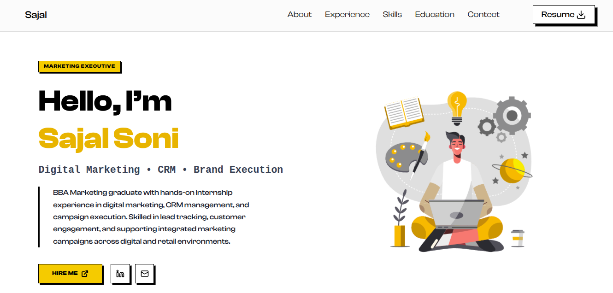

# 🚀 Professional Marketing Portfolio | Neubrutalism Edition

A professional and modern portfolio website built with a **Neubrutalism** aesthetic, designed to showcase marketing expertise and internship achievements. This project was custom-developed for **Sajal Soni (Marketing Executive)** to provide a bold, interactive, and high-conversion digital presence.

---

## ✨ Key Features

- **Neubrutalism UI Design**: Features bold typography, thick 4px black borders, and a high-contrast color palette (Yellow/White/Black) for a distinct, modern look.
- **Mobile-First Responsiveness**: Fully optimized for Mobile, Tablet, and Desktop devices using a mobile-first CSS strategy.
- **Lottie SVG Animations**: Integrated interactive and lightweight animations in the Hero and Contact sections to enhance user engagement.
- **Dynamic Layout Management**: 
  - **Mobile Stacking**: Implemented a `flex-col-reverse` strategy for mobile screens to ensure animations appear above the text for better visual hierarchy.
  - **Optimized Grids**: Responsive grid systems for the Skills and Experience sections to ensure perfect readability on small screens.
- **Interactive Technical Components**: 
  - **Smooth Navigation**: Seamless scroll-to-section functionality.
  - **Direct CTAs**: Fully functional `mailto:` links, LinkedIn redirects, and a dedicated Resume Download trigger.
  - **Neubrutalism Cards**: Hover-reactive cards with hard-shadow offsets for a tactile UI feel.

---

## 🛠️ Tech Stack

- **Frontend**: [React.js](https://react.dev/)
- **Styling**: [Tailwind CSS](https://tailwindcss.com/)
- **Icons**: [Lucide React](https://lucide.dev/)
- **Animations**: [Lottie React](https://github.com/LottieFiles/lottie-react) & [Framer Motion](https://www.framer.com/motion/)

---

## 📂 Project Structure

```text
src/
├── assets/             
├── components/        
│   ├── Navbar.jsx      
│   ├── HeroSection.jsx 
│   ├── AboutSection.jsx
│   ├── Experience.jsx  
│   ├── SkillsSection.jsx
│   └── ContactSection.jsx
└── App.jsx           
```
## 🔗 Live Link -> **[sajal-portfolio](https://sajal-portfolio-indol.vercel.app/)**

## 📸 Screenshots
<p align="center">
  
  
</p>

## 👾 Created By Bhavishy🔥
